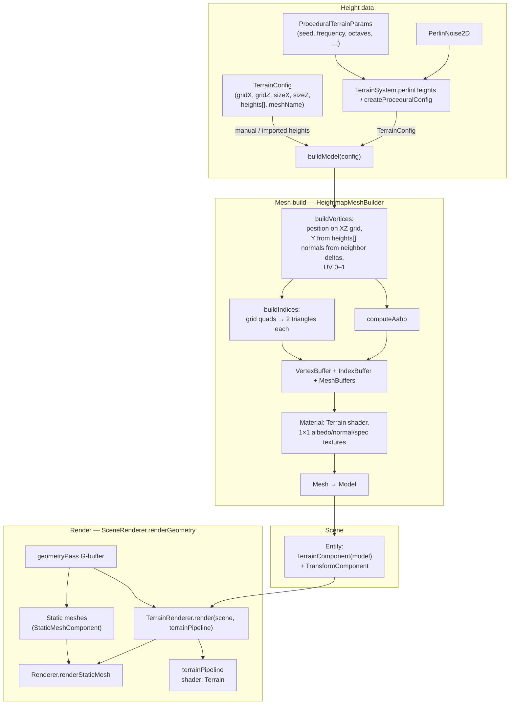
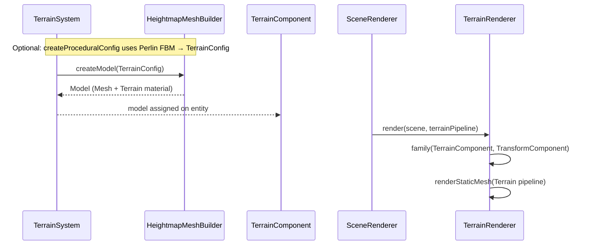

# Rune Terrain System

## Architecture

---
The Rune engine uses a heightmap-based system for generating procedural terrain.
The heightmap is stored on the CPU.

## How it works

---
[TerrainSystem.createModel()](TerrainSystem.kt) serves as the entry point for creating
any terrain meshes in Rune. It takes in a [TerrainConfig](TerrainConfig.kt) in order to 
specify the grid size, quad size, and heights as a FloatArray. In order to specify parameters
for the heightmap itself, we use [ProceduralTerrainParams](ProceduralTerrainParams.kt) to fine-tune
the generation of heights. These parameters are fed into the perlin algorithm to generate the heights.

## PerlinNoise2D.kt

---
The initialization step shuffles an array of Ints, and doubles it. This is done to 

### `noise()`
For any point (x, y), we do a grid lookup to identify which grid cell the points falls in. 
The fraction parts (xf, xy) tells you where _within_ the grid cell the point is. The fractional
coordinates are then put in a smoothing function in order to get rid of grid-line artifacts (Rune uses a quintic curve,
but this can be changed). 

We then sample the permutation table to produce a pseudo-random hash for each of the four
corners (aa, ab, ba, bb) and then maps each hash to one of four unit gradients
(1, 1), (-1, 1), (1, -1), (-1, -1). The dot product is then taken of that gradient with the vector from the corner to
the given point. 

The four dot products are then blended, outputing a smooth value within [-1, 1].

### `fbm()`
In order to create more detailed surfaces, we utilize Fractal Brownian Motion to add texture
to our perlin noise. There is a concept of octaves (set in [ProceduralTerrainParams](ProceduralTerrainParams.kt)
that controls this, as well as other parameters such as lacunarity and persistence. 

The effect of this is that of progressively adding detail to the mesh, decreasing in magnitude
each octave. The first octave will have larger geographic influence, while the last octaves will
add small details, like rocks and roughness.

### Diagram

Overview of data flow (height data → mesh → scene) and the render path:

Creation vs render sequence:

## Mask-based heightmaps

---
The new mask-based heightmap is based around the HeightField object and uses nodes
to adjust the heightmap in-place. 

TerrainNodes are 